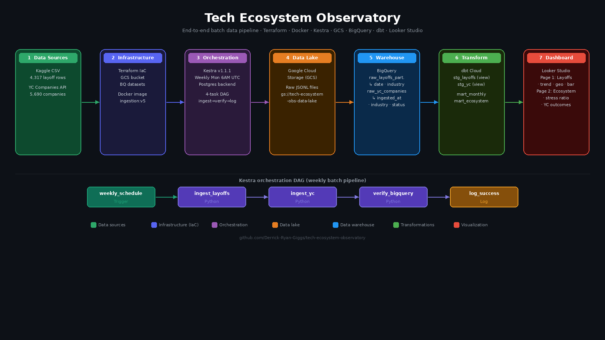

# Tech Ecosystem Observatory

> A cloud-native batch data pipeline analyzing global tech ecosystem health by correlating layoff trends with YC startup activity across industries and geographies.

## Live Dashboard

**[View Dashboard on Looker Studio](https://lookerstudio.google.com/reporting/b1620cae-97cb-4911-82b8-dd0c46ee8acb)**

The dashboard has two pages:
- **Page 1 — Layoffs Trends:** Monthly trend, top industries by layoffs, geo map, scorecards
- **Page 2 — Ecosystem Health:** Stress ratio by industry, YC company outcomes, scorecards

---

## Architecture



```
Kaggle CSV + YC API
        │
        ▼
  Kestra (batch orchestration — weekly Monday 6AM UTC)
        │
        ▼
  Google Cloud Storage (raw JSONL data lake)
        │
        ▼
  BigQuery (partitioned + clustered tables)
        │
        ▼
  dbt Cloud (staging views → mart tables)
        │
        ▼
  Looker Studio (2-page dashboard)
```

### Kestra Orchestration DAG

The pipeline runs as a 4-task sequential DAG inside Kestra:

```
weekly_schedule → ingest_layoffs → ingest_yc → verify_bigquery → log_success
```

- `weekly_schedule` — cron trigger every Monday 6AM UTC
- `ingest_layoffs` — reads CSV from GCS, uploads JSONL, loads to BigQuery
- `ingest_yc` — fetches YC API, uploads JSONL, loads to BigQuery
- `verify_bigquery` — confirms both tables have expected row counts
- `log_success` — logs pipeline completion timestamp

---

## Problem Description

The tech industry has experienced significant turbulence since 2022 — mass layoffs across major companies while new startups continue to emerge through accelerators like Y Combinator. This project builds an end-to-end data pipeline to answer:

- Which industries are shedding the most jobs?
- How do layoff trends correlate with YC startup activity by sector?
- Which countries show the highest concentration of layoffs?
- Is there a relationship between how much funding a company raised and whether it laid off workers?
- Which sectors show the most ecosystem stress (high layoffs relative to startup activity)?

---

## Tech Stack

| Layer | Tool | Purpose |
|---|---|---|
| Infrastructure | Terraform | Provision GCS bucket and BigQuery datasets |
| Containerization | Docker | Package ingestion scripts into a portable image |
| Orchestration | Kestra v1.1.1 | Schedule and run the batch pipeline weekly |
| Data Lake | Google Cloud Storage | Store raw JSONL files |
| Data Warehouse | BigQuery | Partitioned and clustered analytical tables |
| Transformations | dbt Cloud | Staging views and mart tables |
| Visualization | Looker Studio | Two-page interactive dashboard |
| Version Control | GitHub | Source code and pipeline definitions |

---

## Data Sources

| Source | Description | Rows | Format |
|---|---|---|---|
| [Kaggle — swaptr/layoffs-2022](https://www.kaggle.com/datasets/swaptr/layoffs-2022) | Global tech layoffs 2023–2024 | 4,317 | CSV |
| [YC OSS API](https://yc-oss.github.io/api/companies/all.json) | All YC-backed companies | 5,690 | JSON (public, no auth) |

### Sample YC API Response

The YC Companies API returns a JSON array with no authentication required. A sample record:

```json
{
  "id": 1,
  "name": "Airbnb",
  "slug": "airbnb",
  "all_locations": "San Francisco, CA, USA",
  "website": "https://airbnb.com",
  "batch": "W09",
  "status": "Public",
  "industry": "Consumer",
  "tags": ["Travel", "Housing"],
  "team_size": 6132,
  "long_description": "Airbnb is an online marketplace for short-term homestays and experiences."
}
```

A sample response file is saved at `ingestion/yc_sample.json` for reference and reproducibility.

### Layoffs CSV Columns

| Column | Type | Description |
|---|---|---|
| company | STRING | Company name |
| industry | STRING | Industry sector |
| country | STRING | Country of the layoff event |
| location | STRING | City/region |
| date | DATE | Date of the layoff event |
| total_laid_off | INTEGER | Number of employees laid off |
| percentage_laid_off | FLOAT | Percentage of workforce laid off |
| funds_raised | FLOAT | Total funds raised by company (millions) |
| stage | STRING | Company funding stage |

---

## Data Warehouse Design

### Tables

| Table | Layer | Type | Rows |
|---|---|---|---|
| `raw.raw_layoffs_partitioned` | Raw | Partitioned + Clustered | 4,317 |
| `raw.raw_yc_companies_partitioned` | Raw | Partitioned + Clustered | 5,690 |
| `dbt_ryanderrick_staging.stg_layoffs` | Staging | View | — |
| `dbt_ryanderrick_staging.stg_yc_companies` | Staging | View | — |
| `dbt_ryanderrick_mart.mart_monthly_layoffs` | Mart | Table | — |
| `dbt_ryanderrick_mart.mart_tech_ecosystem` | Mart | Table | — |

### Partitioning and Clustering

**`raw_layoffs_partitioned`**
- **Partitioned by:** `DATE_TRUNC(date, MONTH)`
  Layoff data is primarily queried by time range — monthly trends and quarterly comparisons. Monthly partitioning means BigQuery only scans the relevant month partitions instead of the full 4,317-row table, reducing both query time and cost significantly.
- **Clustered by:** `industry`, `country`
  The most common analytical queries filter or GROUP BY industry and country. Clustering physically co-locates rows with the same values, making these filters significantly faster.

**`raw_yc_companies_partitioned`**
- **Partitioned by:** `DATE(ingested_at)`
  Supports incremental refresh patterns — future pipeline runs can filter to recently ingested records only, avoiding full table scans.
- **Clustered by:** `industry`, `status`
  Dashboard queries frequently filter by industry sector and company status (Active, Acquired, Inactive). Clustering on these columns reduces bytes scanned.

---

## dbt Transformations

```
raw layer (BigQuery)
    └── staging (dbt views)
          ├── stg_layoffs          — cleans nulls, filters zero-layoff rows, standardizes columns
          └── stg_yc_companies     — cleans nulls, flattens tags, standardizes columns
    └── marts (dbt tables)
          ├── mart_monthly_layoffs — monthly aggregation by industry and country
          └── mart_tech_ecosystem  — industry-level join of layoffs + YC activity (stress ratio)
```

**`stg_layoffs`** — filters rows where `date IS NULL` or `total_laid_off = 0`, standardizes column names, casts types.

**`stg_yc_companies`** — filters rows where `name IS NULL`, flattens the tags array to a comma-separated string, cleans whitespace from `long_description`.

**`mart_monthly_layoffs`** — aggregates by month, industry, and country. Produces: `num_events`, `total_laid_off`, `avg_percentage_laid_off`, `total_funds_raised`.

**`mart_tech_ecosystem`** — full outer join of layoffs and YC companies on `industry`. Produces: `total_laid_off`, `num_layoff_events`, `total_funds_raised`, `total_yc_companies`, `active_companies`, `acquired_companies`, `avg_team_size`, `layoffs_per_yc_company` (stress ratio).

---

## Dashboard

**[Live Dashboard](https://lookerstudio.google.com/reporting/b1620cae-97cb-4911-82b8-dd0c46ee8acb)**

### Page 1 — Layoffs Trends (source: `mart_monthly_layoffs`)

| Chart | Type | X-axis | Y-axis | Title |
|---|---|---|---|---|
| 1 | Time series | `month` | `total_laid_off` | Monthly tech layoffs trend (2023–2024) |
| 2 | Horizontal bar | `total_laid_off` | `industry` | Top 10 industries by total employees laid off |
| 3 | Geo map | `country` | `total_laid_off` | Global layoff distribution by country |
| 4 | Scorecard | — | `total_laid_off` (SUM) | Total employees laid off |
| 5 | Scorecard | — | `num_events` (SUM) | Total layoff events recorded |

### Page 2 — Ecosystem Health (source: `mart_tech_ecosystem`)

| Chart | Type | X-axis | Y-axis | Title |
|---|---|---|---|---|
| 6 | Horizontal bar | `layoffs_per_yc_company` | `industry` | Ecosystem stress ratio — layoffs per YC company |
| 7 | Stacked bar | `industry` | `active_companies` + `acquired_companies` | YC company outcomes by industry |
| 8 | Scorecard | — | `total_yc_companies` (SUM) | Total YC companies analyzed |
| 9 | Scorecard | — | `industry` (count distinct) | Industries covered |

---

## Reproducing the Project

### Prerequisites

- GCP account with billing enabled
- [Docker](https://docs.docker.com/get-docker/) and Docker Compose installed
- [Terraform](https://developer.hashicorp.com/terraform/install) installed
- [dbt Cloud](https://cloud.getdbt.com) account (free Developer tier)
- [Kaggle](https://www.kaggle.com) account

### Step 1 — Clone the repo

```bash
git clone https://github.com/Derrick-Ryan-Giggs/tech-ecosystem-observatory.git
cd tech-ecosystem-observatory
```

### Step 2 — Set up GCP

1. Go to [console.cloud.google.com](https://console.cloud.google.com) and create a new project. Note the **Project ID**.
2. Enable these APIs on your project:
   - BigQuery API
   - Cloud Storage API
3. Create a service account:
   - Go to **IAM & Admin → Service Accounts → Create Service Account**
   - Name: `tech-obs-sa`
   - Grant roles: `BigQuery Admin`, `Storage Admin`
   - Click **Keys → Add Key → JSON** and download the file
4. Save the credentials:

```bash
mkdir -p ~/.gcp
mv ~/Downloads/your-key.json ~/.gcp/tech-obs-sa.json
```

### Step 3 — Provision infrastructure with Terraform

```bash
cd terraform

cat > terraform.tfvars << EOF
project_id  = "YOUR_GCP_PROJECT_ID"
region      = "us-central1"
credentials = "~/.gcp/tech-obs-sa.json"
EOF

terraform init
terraform apply
```

This provisions:
- GCS bucket: `YOUR_PROJECT_ID-data-lake`
- BigQuery datasets: `raw`, `staging`, `mart` (all in `us-central1`)

### Step 4 — Get the layoffs dataset

The `layoffs.csv` file is included in the repo at `ingestion/layoffs.csv` for reproducibility. To download the latest version from Kaggle:

```bash
pip install kaggle
# Place your kaggle.json at ~/.kaggle/kaggle.json
kaggle datasets download -d swaptr/layoffs-2022 --unzip
mv layoffs.csv ingestion/layoffs.csv
```

### Step 5 — Upload the layoffs CSV to GCS

```bash
gsutil cp ingestion/layoffs.csv \
  gs://YOUR_PROJECT_ID-data-lake/raw/layoffs/layoffs.csv
```

Update the `GCS_CSV_PATH` variable in `docker/ingest_layoffs.py` to match your bucket name and file path.

### Step 6 — Build the Docker image

```bash
cd docker

# Copy your GCP credentials into the docker folder
cp ~/.gcp/tech-obs-sa.json credentials.json

# Build the image
docker build -t tech-obs-ingestion:v5 .
```

> The credentials are baked into the image for local development only. Do not push this image to a public registry.

### Step 7 — Start Kestra

```bash
cd kestra
docker compose up -d

# Wait ~60 seconds for Kestra to initialize
docker compose logs -f kestra | grep -m1 "Server Running"
```

Open [http://localhost:8080](http://localhost:8080) and complete the account setup wizard. Kestra uses a Postgres backend so your flow and settings persist across restarts.

### Step 8 — Register the Kestra flow

In the Kestra UI:
1. Go to **Flows → New Flow**
2. Paste the contents of `kestra/tech_observatory_flow.yml`
3. Save

Update the `image` field in the flow YAML to match your Docker image name if you changed it.

### Step 9 — Trigger the pipeline

In the Kestra UI:
1. Go to **Flows → tech_observatory_pipeline**
2. Click **Execute**
3. All 4 tasks should complete successfully:
   - `ingest_layoffs` → loads 4,317 rows into `raw.raw_layoffs_partitioned`
   - `ingest_yc` → loads 5,690 rows into `raw.raw_yc_companies_partitioned`
   - `verify_bigquery` → confirms both tables have data
   - `log_success` → logs completion timestamp

The pipeline also runs automatically every Monday at 6AM UTC via the built-in schedule trigger.

### Step 10 — Create partitioned and clustered tables

Run these in the BigQuery console:

```sql
CREATE OR REPLACE TABLE `YOUR_PROJECT_ID.raw.raw_layoffs_partitioned`
PARTITION BY DATE_TRUNC(date, MONTH)
CLUSTER BY industry, country
AS SELECT * FROM `YOUR_PROJECT_ID.raw.raw_layoffs`;

CREATE OR REPLACE TABLE `YOUR_PROJECT_ID.raw.raw_yc_companies_partitioned`
PARTITION BY DATE(ingested_at)
CLUSTER BY industry, status
AS SELECT * FROM `YOUR_PROJECT_ID.raw.raw_yc_companies`;
```

### Step 11 — Run dbt transformations

1. Create a free account at [cloud.getdbt.com](https://cloud.getdbt.com)
2. Create a new project:
   - Connect to BigQuery — upload your service account JSON key
   - Set **Location** to `us-central1` in Optional Settings
   - Connect to GitHub repo: `Derrick-Ryan-Giggs/tech-ecosystem-observatory`
3. In the dbt Cloud IDE, run:

```
dbt run
```

This creates 4 models across two datasets in your BigQuery project.

### Step 12 — View the dashboard

Open the live dashboard:
[https://lookerstudio.google.com/reporting/b1620cae-97cb-4911-82b8-dd0c46ee8acb](https://lookerstudio.google.com/reporting/b1620cae-97cb-4911-82b8-dd0c46ee8acb)

To build your own copy:
1. Go to [lookerstudio.google.com](https://lookerstudio.google.com)
2. Create a new report and connect to BigQuery → your project → `dbt_ryanderrick_mart`
3. Add `mart_monthly_layoffs` as the primary data source
4. Add `mart_tech_ecosystem` as a second data source
5. Recreate the charts as documented in the Dashboard section above

---

## Project Structure

```
tech-ecosystem-observatory/
├── docker/
│   ├── Dockerfile                    # Docker image definition
│   ├── ingest_layoffs.py             # Reads CSV from GCS, loads to BigQuery
│   ├── ingest_yc.py                  # Fetches YC API, loads to BigQuery
│   └── verify.py                     # Confirms row counts in BigQuery
├── ingestion/
│   ├── layoffs.csv                   # Source layoffs data (included for reproducibility)
│   ├── yc_sample.json                # Sample YC API response for reference
│   ├── ingest_layoffs.py             # Local ingestion scripts
│   └── ingest_yc.py
├── kestra/
│   ├── docker-compose.yml            # Kestra + Postgres backend setup
│   └── tech_observatory_flow.yml     # Pipeline flow definition (4 tasks)
├── models/
│   ├── staging/
│   │   ├── stg_layoffs.sql
│   │   ├── stg_yc_companies.sql
│   │   └── schema.yml
│   └── marts/
│       ├── mart_monthly_layoffs.sql
│       ├── mart_tech_ecosystem.sql
│       └── schema.yml
├── terraform/
│   ├── main.tf                       # GCS bucket + BigQuery datasets
│   ├── variables.tf
│   └── terraform.tfvars.example      # Template — copy to terraform.tfvars
├── images/
│   └── architecture_diagram.png
├── dbt_project.yml
└── README.md
```

---

## Evaluation Criteria Checklist

| Criterion | Points | Implementation |
|---|---|---|
| Problem description | 4/4 | Clearly defined — correlating layoffs with YC startup activity |
| Cloud + IaC | 4/4 | GCP (BigQuery, GCS) provisioned with Terraform |
| Batch orchestration | 4/4 | Kestra end-to-end pipeline, weekly schedule, 4-task DAG |
| DWH partitioning + clustering | 4/4 | Both raw tables partitioned and clustered with written explanation |
| dbt transformations | 4/4 | 4 models across staging and mart layers using dbt Cloud |
| Dashboard | 4/4 | 2-page Looker Studio dashboard |
| Reproducibility | 4/4 | Step-by-step from GCP setup to dashboard, sample data included |
| **Total** | **28/28** | |

---

## Author

**Ryan Derrick Giggs** — Data Engineer & Technical Writer based in Nairobi, Kenya.

- GitHub: [@Derrick-Ryan-Giggs](https://github.com/Derrick-Ryan-Giggs)
- LinkedIn: [linkedin.com/in/ryan-giggs-a19330265](https://linkedin.com/in/ryan-giggs-a19330265)
- Medium: [medium.com/@derrickryangiggs](https://medium.com/@derrickryangiggs)
- Dev.to: [dev.to/derrickryangiggs](https://dev.to/derrickryangiggs)
- Hashnode: [ryan-giggs.hashnode.dev](https://ryan-giggs.hashnode.dev)

DEZ Zoomcamp 2026 Cohort
